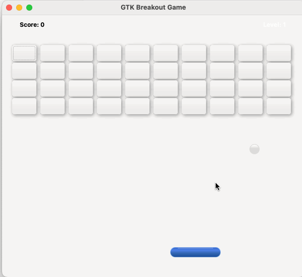

# GTK Breakout Game

A classic Breakout arcade game implementation using GTK and Cairo graphics.



## Features

- Polished gameplay with physics-based ball movement
- Colorful bricks with shadow effects
- Advanced paddle with custom drawing and realistic movement physics
- Multiple levels with increasing difficulty
- Score tracking and level progression
- Clean, modern UI with gradient background

## Controls

- **Left/Right Arrow Keys** or **A/D Keys**: Move the paddle
- **Escape Key**: Exit the game

## Building the Game

### Prerequisites

- GCC compiler
- GTK3 development libraries

On macOS:
```bash
brew install gtk+3
```

On Ubuntu/Debian:
```bash
sudo apt-get install libgtk-3-dev
```

### Compilation

The game can be built using the provided Makefile:

```bash
make
```

### Running the Game

After compilation, run the executable:

```bash
./widget_breakout
```

## How to Play

1. Move the paddle to bounce the ball
2. Break all the bricks to advance to the next level
3. Each level increases in difficulty with:
   - Bricks requiring multiple hits
   - Faster ball movement
   - Higher potential score

## Technical Implementation

This game showcases several GTK and Cairo features:

- Custom Cairo drawing for the paddle
- CSS styling for UI elements
- GTK widget management and layout
- Event handling for keyboard input
- Animation using GLib timers

## License

This project is free to use and modify for personal and educational purposes.
